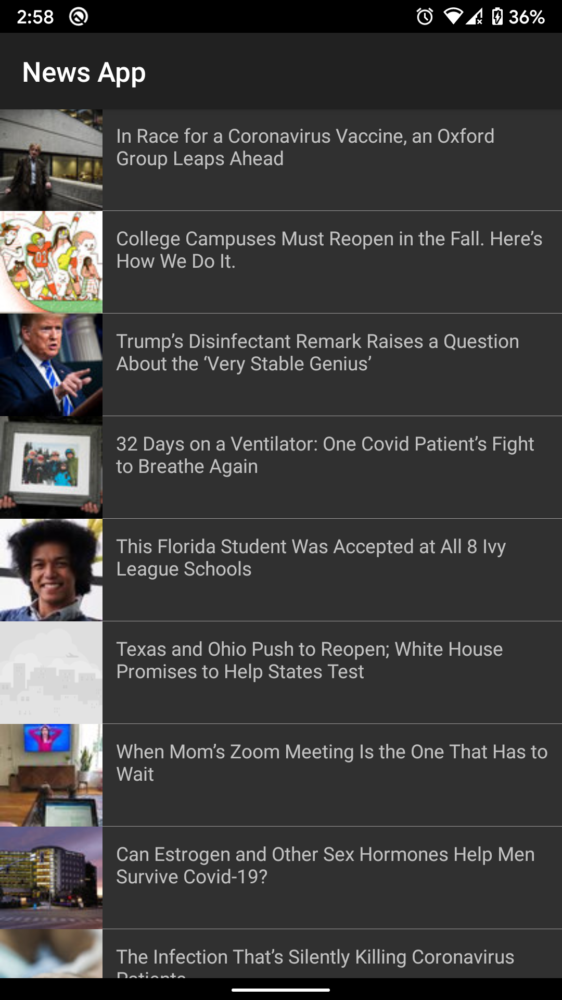
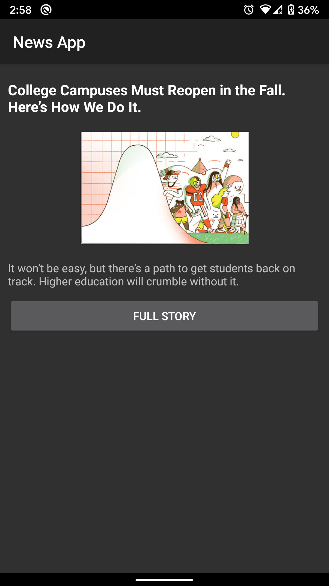
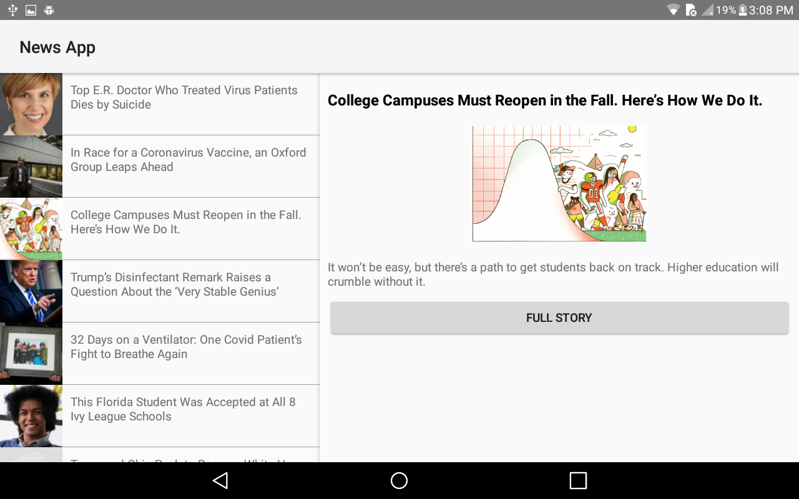
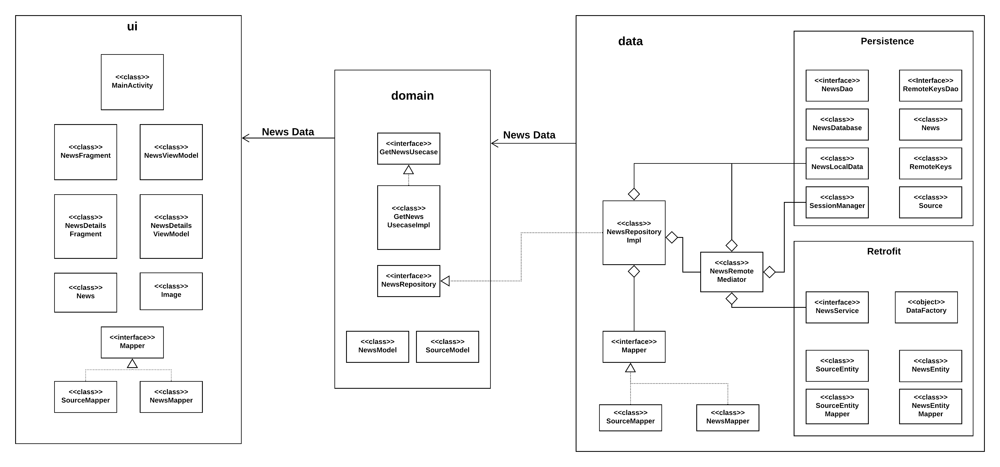

# News Application
This is a very simple (for now) News app that takes most popular news for the day from NYTimes API and displays them.

The main purpose of the application is to showcase and experiment with Android technologies.

  

## Implementation Details
The solution is implemented using **[Clean Architecture](https://blog.cleancoder.com/uncle-bob/2012/08/13/the-clean-architecture.html)** and the structure can be seen in the following diagram;

The implementation contains following features;
1. **Master Detail Flow** for screen wider than 600dp
2. **Dark Theme** support for Android 10
3. The user can always swipe down on the list to refresh the data from the API.
4. All the project dependencies are injected using **Dagger2**
5. The data is fetched from the Newyork Times API using **Retrofit2**
6. Json parsing is done using Google GSON.
7. The project also contains **Unit** and **Instrumented tests** implemented using **JUnit4 Androidx tests, Espresso and Mockito**.

## Project Setup
1. Clone the project and run it in Android studio.
2. Go to [New York Times Developer's page](https://developer.nytimes.com/) and Sign up.
3. Follow these instructions: [https://developer.nytimes.com/get-started](https://developer.nytimes.com/get-started) to create an Application, enable __Most Popular API__ and get the API key.
4. Copy the API key generated in previous step and store it in your computers Environment Variables by name: __NewsApiKey__
5. Run the application \m/.
